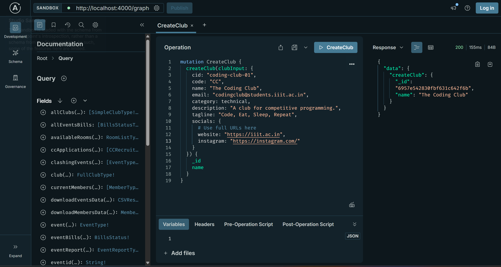
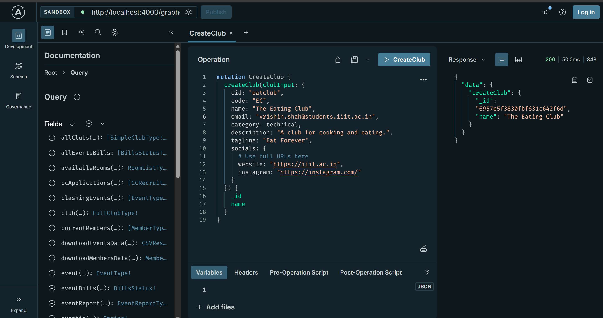
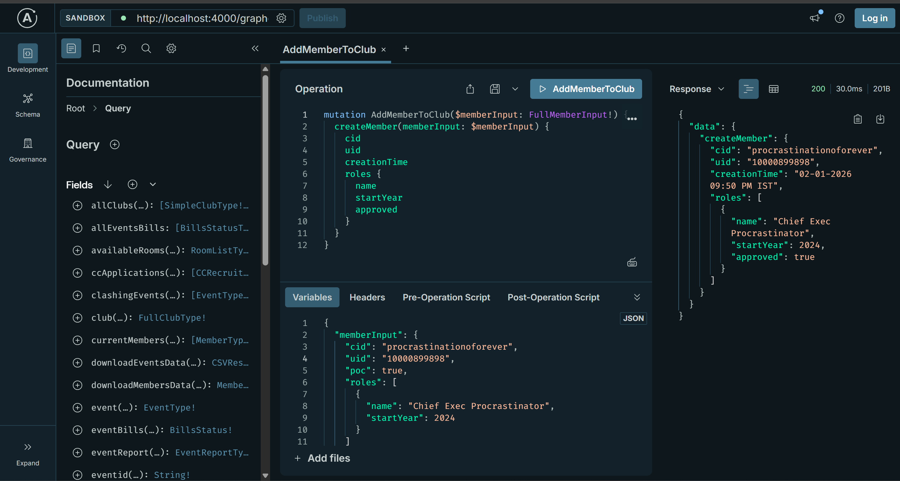
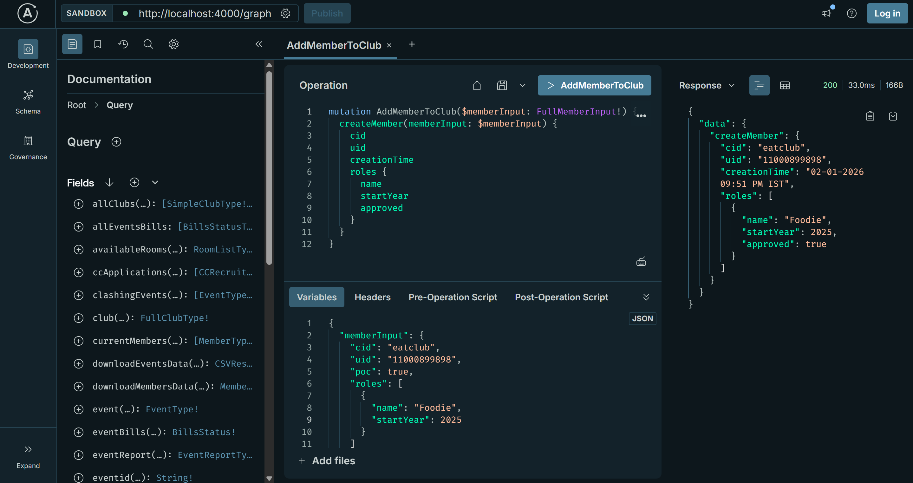
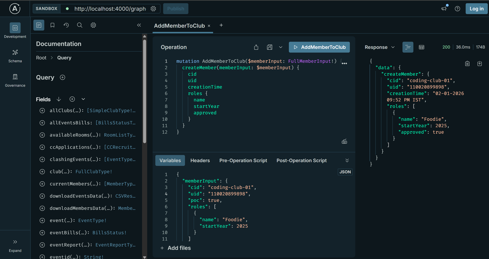
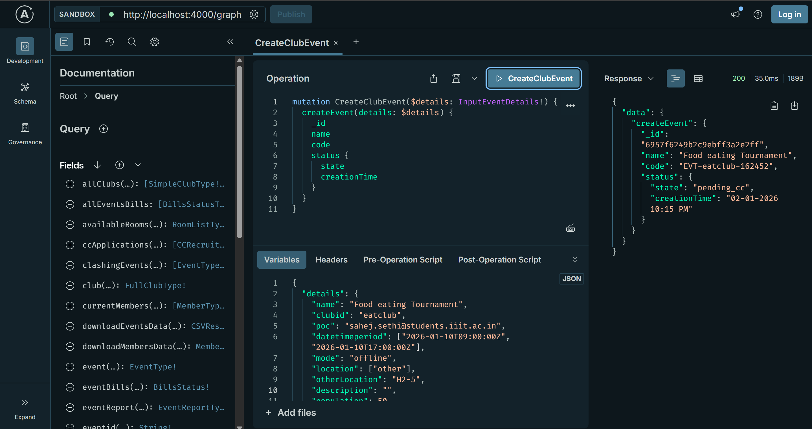
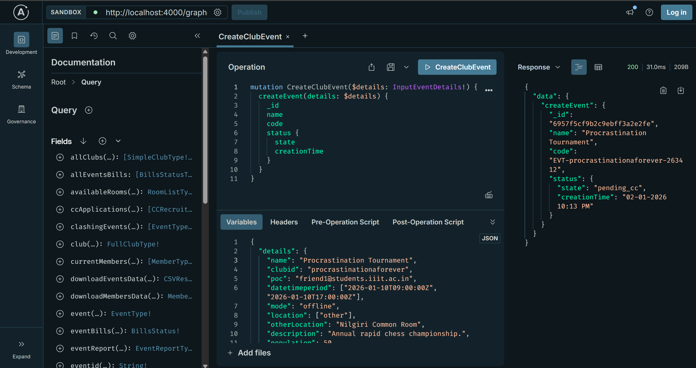

 # SLC Recruitment Task - 1: Docker Deployment & GraphQL Operations

 ## Overview
 This document details the process of setting up the Clubs Council (SLC) codebase locally using Docker, bypassing authentication mechanisms for private repositories, and performing specific GraphQL mutations to populate the database with dummy data (Clubs, Members, and Events).

 ---

 ## Part 1: Local Deployment (Docker)

 To run the microservices architecture locally, several modifications were required in the `docker-compose.yml` file within the `services` repository. Since the `auth` and `files` repositories are private, they were disabled to ensure the remaining stack could spin up successfully.

 ### Setup Steps Executed

 1.  **Cloning & Configuration:**
     * Cloned the repository and initialized submodules.
     * Created `.env` files for all services using the provided examples.

 2.  **Modifying `docker-compose.yml`:**
     * Analyzed the composition and identified services causing build failures due to missing access rights.
     * **Action:** Commented out the `auth` and `files` services.
     * **Action:** Removed dependency links to these services from the Nginx configuration to prevent routing errors.

 3.  **Environment Fixes:**
     * Updated entrypoint scripts to ensure LF (Line Feed) line endings were used, resolving Windows CRLF compatibility issues.

 4.  **Running the Stack:**
     * Executed the build command:
         ```bash
         docker compose up -d --build
         ```
     * Verified that the Gateway, Subgraphs (clubs, members, events), and MongoDB containers were healthy.

 
 *Figure 1: Successful deployment verified by accessing the frontend dashboard.*

 ---

 ## Part 2: Authentication Bypass Strategy

 Since the `auth` service was disabled, standard authentication tokens would fail. To perform privileged mutations (like creating clubs and adding members), a bypass was implemented in the resolvers.

 ### Code Modifications
 We modified the `mutations.py` files in `subgraphs/members`, `subgraphs/clubs`, and `subgraphs/events`. The following logic was injected to mock a "Clubs Council" (CC) admin user if no user context was found:

 ```python
 # Injected Mock User for Auth Bypass
 user = info.context.user
 if user is None:
     user = {"role": "cc", "uid": "cc"}
 ```

 This modification treats every unauthenticated request as a privileged administrator action, allowing full access to the GraphQL API.

 ---

 ## Part 3: GraphQL Operations & Data Population

 Once the Gateway was accessible at `http://localhost:4000/graph` (or `http://localhost/graphql`), the following operations were performed.

 ### Step 1: Creating Clubs
 Three distinct clubs were created using the `createClub` mutation.

 **1. The Coding Club**
 Created with code `CC` and category `technical`.
 

 **2. The Eating Club**
 Created with code `EC` and tagline "Eat Forever".
 

 **3. The Procrastination Protocol**
 Created with code `LATER` and description "Mastering the art of ing 5-day assignments 4 hours before the deadline."
 

 ---

 ### Step 2: Adding Members
 Members were added to the newly created clubs. The authentication bypass allowed us to assign roles without valid login tokens.

 **1. Adding a Member to The Procrastination Protocol**
 Role: "Chief Exec Procrastinator".
 

 **2. Adding a Member to The Eating Club**
 Role: "Foodie".
 

 **3. Adding a Member to The Coding Club**
 Role: "Foodie" (assigned to the coding club for demonstration).
 

 ---

 ### Step 3: Adding Events
 Events were populated for the clubs to test the `events` subgraph.

 **1. Event for The Eating Club**
 Event Name: "Food eating Tournament".
 Location: "H2-5".
 

 **2. Event for The Procrastination Protocol**
 Event Name: "Procrastination Tournament".
 Description: "Annual rapid chess championship" (ironically placed).
 

 ---

 ## Conclusion
 By isolating the core services and bypassing the authentication layer, we successfully deployed the backend infrastructure locally. The GraphQL screenshots confirm that the `Clubs`, `Members`, and `Events` subgraphs are communicating correctly with the Gateway and MongoDB.