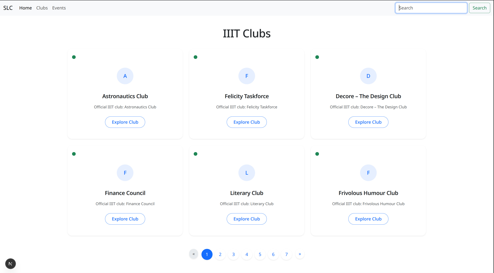
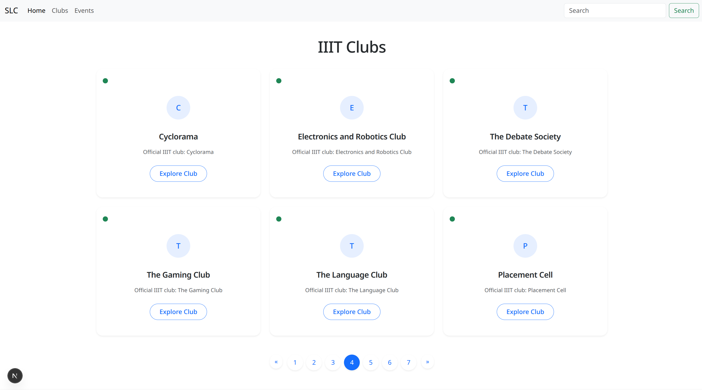
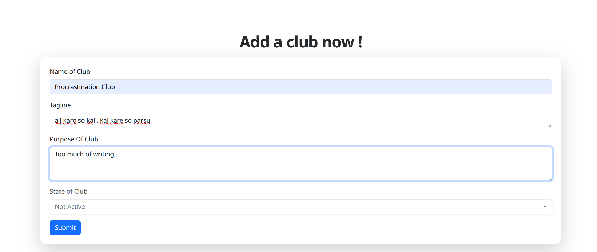
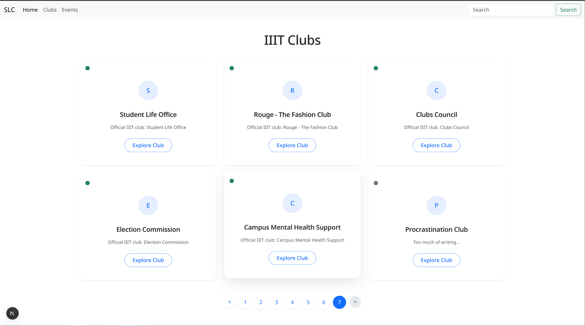
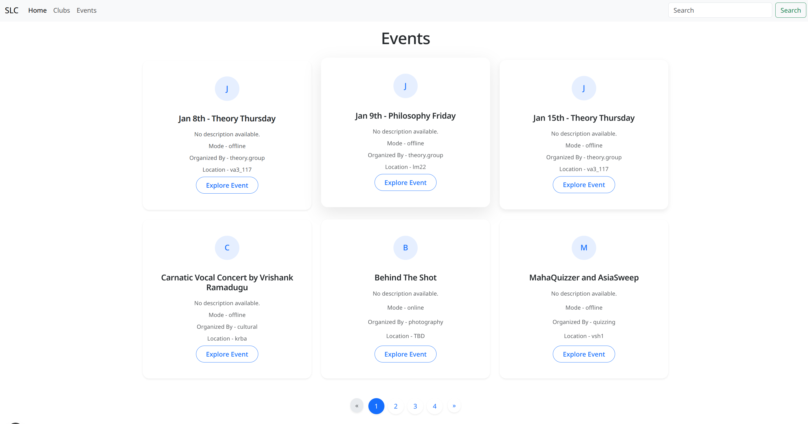
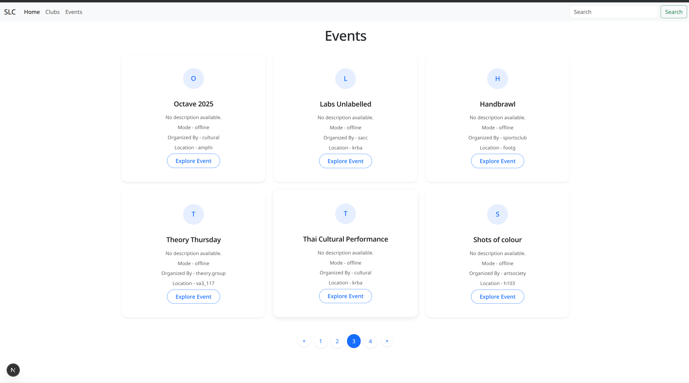
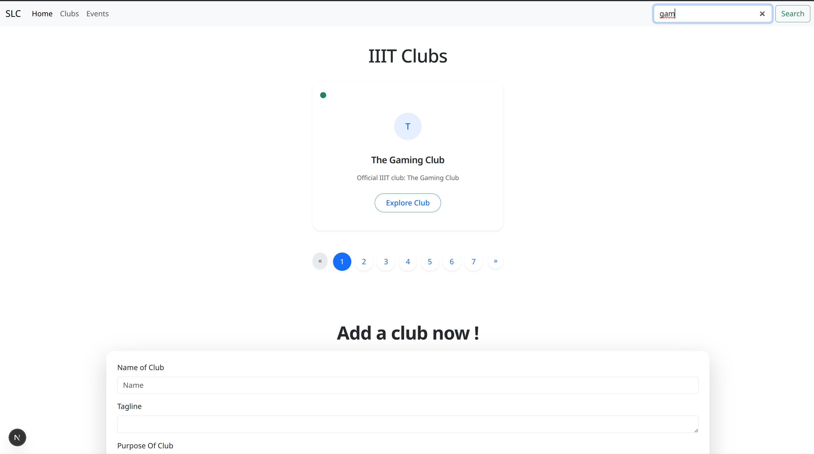
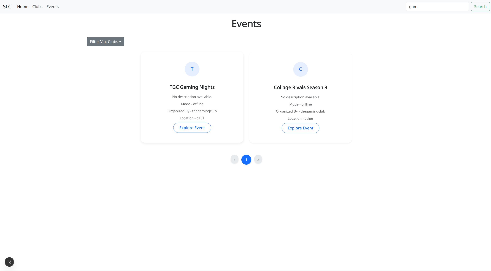
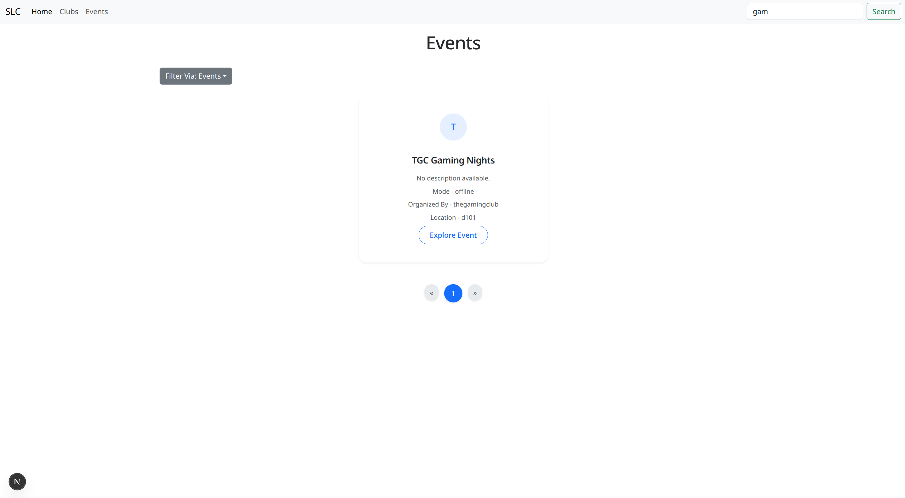

 # **IIIT Clubs & Events Portal**
 
 This is a  full-stack, federated GraphQL application built with **Next.js**, **Apollo Federation**, **FastAPI**, and **MongoDB**. This project is fully containerized using Docker for seamless "one-click" deployment on Windows and Linux (Fedora). It mimmics the working of the actual website though simpler in nature (made by me). (it is not exactly a wordpress)
 
 ---
 
 ## 📂 Project Structure & Tasks
 
 ### 🔹 Task 1: Backend Logic & GraphQL Gateway
 * **Location:** `Task 1` folder directory.
 * **Description:** Implements the core GraphQL Gateway queries and mutations.
 * **Documentation:** Screenshots of working gateway queries/mutations and outputs are documented in `slca1.docx` and its **readme.md**.
 * **Compatibility:** Optimized for Windows environment.
 
 ### 🔹 Task 2: Full-Stack Web Application (WordPress Alternative)
 * **Location:** Root directory.
 * **Description:** A fully functional website where the frontend (Next.js) interacts dynamically with the backend subgraphs.
 * **Compatibility:** Cross-platform (Verified on both Windows and Linux/Fedora).
 
 ---
 
 ## 💻 Technical Implementation & Features
 
 ### 1. Decoupled Microservices Architecture
 The backend is split into independent subgraphs using **Apollo Federation**. The `Clubs` service (Python/FastAPI) runs autonomously, exposing its own schema. The Frontend (Next.js) consumes this data via a unified Gateway, ensuring modularity and scalability.
 
 * **Tech Stack:** FastAPI, Python, MongoDB, Apollo Gateway.
 * **UI Implementation:** Responsive grid layouts built with Bootstrap/Tailwind.
 
 

 Multiple pages is implemented to keep the page clutter free in case the amount of data is huge.
 

 Club Can be easily added to backend (no auth as of now) via the form provided
 
 
 
 
 The added club is immediately vissible in the clubs page indicating direct connection between backend and frontend via Apollo Gateway
 
 
 
 ### 2. Federated Data Stitching
 The `Events` service is a separate microservice running on port 8001. The Apollo Gateway stitches this schema with the Clubs schema, allowing the client to query related data (e.g., an Event organized by a specific Club) in a single request without complex client-side join logic.
 
 
 
 
 ### 3. Client-Side State Management & Querying (SEARCHING BONUS)
 The application leverages React Hooks (`useState`, `useEffect`) and Apollo Client to handle real-time data filtering.
 
 **Reactive Search Logic:**
 Input changes trigger re-renders that filter the cached GraphQL dataset instantly, providing a seamless "live search" experience without hammering the backend for every keystroke.
 
 
 **Context-Aware Filtering:**
 The filter component dynamically updates the view based on metadata passed from the backend, allowing users to slice data by organization or category.
 
 
 **Conditional Rendering:**
 The UI conditionally renders components based on the filtered state, ensuring the DOM only updates what is necessary.
 
 
 ### 4. GraphQL Mutation Integration
 Data persistence is handled via GraphQL Mutations. The "Add Club" form utilizes controlled components to capture user input and executes a structured mutation request to the Gateway, which routes the write operation to the specific MongoDB collection.
 
 * **Operation:** `mutation { addClub(...) }`
 * **Validation:** Frontend form validation coupled with backend schema enforcement.
 
 
 
 ---
 
 ## 🏗️ System Architecture
 
 The application consists of **6 core services** orchestrated via Docker:
 
 1.  **Frontend:** Next.js (Port `3000`)
 2.  **Gateway:** Apollo Gateway (Port `4000`)
 3.  **Clubs Subgraph:** FastAPI/Python (Port `8000`)
 4.  **Events Subgraph:** FastAPI/Python (Port `8001`)
 5.  **Database:** MongoDB (Port `27018`)
 6.  **DB-Seed:** Python utility for automated data seeding on startup.
 
 ---
 
 ## 🚀 Getting Started
 
 ### 📋 Prerequisites
 * **Docker Desktop** (Running on Windows or Linux)
 * **Git**
 
 ### ⚙️ Installation & Setup
 
 **1. Clone the repository:**
 ```bash
 git clone [https://github.com/avikmjd2/slc-p2-a1.git](https://github.com/avikmjd2/slc-p2-a1.git)
 cd slc-p2-a1
 ```
 
 **2. Run with Docker Compose:**
 Open your terminal in the project root and run:
 ```bash
 docker compose up --build
 ```
 *> **Note:** On Linux, ensure Docker Desktop is open. Do not use `sudo` if using Docker Desktop context.*
 
 **3. Verify the Services:**
 Once the logs show "Application startup complete," access the project at:
 * **Frontend:** [http://localhost:3000](http://localhost:3000)
 * **GraphQL Gateway:** [http://localhost:4000/graphql](http://localhost:4000/graphql)
 * **MongoDB:** `mongodb://localhost:27018`
 
 ---
 
 ## 🔧 Troubleshooting (Linux/Fedora)
 
 If you encounter issues on Fedora/Linux, check the following:
 
 * **Permission Denied (SELinux):** Ensure you have added the `:z` flag to your volumes in `docker-compose.yml` if you are using standard Docker Engine (not Desktop) to satisfy SELinux requirements.
 * **Failed to Fetch:** Ensure the Gateway is up. Use `docker compose logs gateway` to check for connection errors between the Next.js frontend and Apollo Gateway.
 * **Folder Names:** Avoid spaces in your project path (e.g., use `Project_Folder` instead of `Project Folder`).
 
 ---
 
 ## 🛠️ Commands Reference
 
 | Action | Command |
 | :--- | :--- |
 | **Start all services** | `docker compose up -d` |
 | **Rebuild and start** | `docker compose up --build` |
 | **Stop all services** | `docker compose down` |
 | **View logs (Gateway)** | `docker compose logs -f gateway` |
 | **Reset Database** | `docker compose down -v` |
